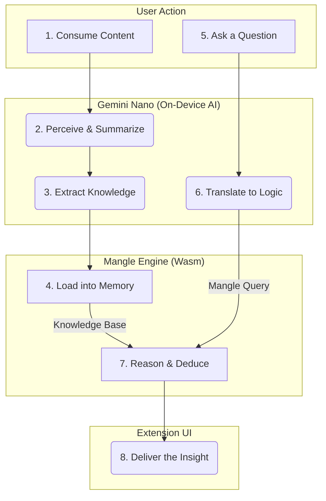
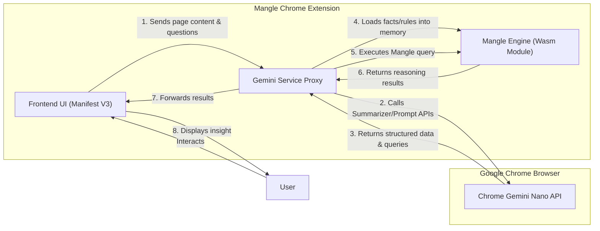

# Mangle Chrome Extension: A Browser with a Brain

*An experimental Chrome extension that gives your browser a persistent, logical memory, enabling on-device AI to reason about the web content you consume.*

## The Problem

Current web browsing is a stateless experience. We consume vast amounts of information, but our browsers have no memory of the content we've seen. AI assistants, while powerful, operate in a similar vacuum, lacking the ability to connect ideas across multiple sessions or detect logical inconsistencies in information gathered over time. This limits their potential from being simple information retrievers to true intellectual partners.

## Our Solution

The Mangle Chrome Extension is our answer. By integrating a Mangle reasoning engine (compiled to Wasm) directly into the browser, we give Gemini Nano a powerful, on-device knowledge graph. This transforms the AI from a simple content processor into an intelligent research assistant that understands, remembers, and reasons about the web content you consume. It's not just a smarter browser; it's a browser with a brain.

## How It Works: The Reasoning Loop

This is the core of our innovation. The extension follows a precise, multi-step process to turn unstructured web content into a queryable, logical knowledge base, all on your local device.

Here is a step-by-step breakdown of the reasoning loop:

1.  **Consume Content:** The user browses the web as usual. When they are on a page they want to "add to their knowledge base," they activate the extension.
2.  **Perceive & Summarize (Gemini Nano):** The extension's content script sends the page text to the on-device Gemini Nano **Summarizer API**.
3.  **Extract Knowledge (Gemini Nano):** The concise summary is then sent to the Gemini Nano **Prompt API** with a specific instruction: *"Convert this text into a structured set of Mangle Datalog facts and rules."* This step transforms unstructured text into structured, logical data.
4.  **Load into Memory (Mangle Wasm):** The generated Mangle facts and rules are passed to the Mangle engine, which is running locally in the browser via a **WebAssembly module**. The engine adds this new knowledge to its existing in-memory knowledge graph.
5.  **Ask a Question (User):** The user can now ask a complex, natural language question about the content they've consumed across multiple pages.
6.  **Translate to Logic (Gemini Nano):** The user's question is sent to the Gemini Nano **Prompt API** with a different instruction: *"Based on the schema of the Mangle facts, translate this question into a formal Mangle query."*
7.  **Reason & Deduce (Mangle Wasm):** The generated Mangle query is executed against the full knowledge graph in the Wasm module. Mangle uses its deductive reasoning capabilities to find the answer, even if it requires connecting facts from multiple different web pages.
8.  **Deliver the Insight:** The result from Mangle is returned to the UI, providing the user with an intelligent, synthesized answer.

## Technical Architecture

The extension is built on a modern, privacy-preserving, on-device stack.

*   **Frontend:** A modern Chrome Extension built with **Manifest V3**, using standard HTML, CSS, and JavaScript Modules for a lightweight and secure user interface.
*   **Perception Layer:** On-device AI powered by the **Google Chrome Gemini Nano API**. We will primarily leverage the `Summarizer` and `Prompt` APIs for knowledge extraction and query translation.
*   **Reasoning Layer:** The core of our innovation. The official Rust implementation of the **Google Mangle** engine, compiled to a highly efficient **WebAssembly (Wasm)** module. This allows for complex, on-device deductive reasoning without any server calls, ensuring privacy and performance.

## Getting Started

To run this extension locally, follow these steps:

**Prerequisites:**
*   Google Chrome (latest version recommended, with AI features enabled).

**Installation Steps:**
1.  Clone the repository: `git clone https://github.com/google/mangle-chrome-extension.git`
2.  Open Chrome and navigate to `chrome://extensions`.
3.  Enable **"Developer mode"** using the toggle in the top-right corner.
4.  Click **"Load unpacked"** and select the `mangle-chrome-extension` folder you just cloned.
5.  The extension icon will appear in the toolbar, ready for use.

## Project Roadmap

This project is ambitious, and we are tackling it in phases.

*   [X] **Phase 1: Foundation** - Basic Manifest V3 extension skeleton. Mock interfaces for Gemini and Mangle services.
*   [ ] **Phase 2: Wasm Integration** - Compile the Mangle Rust engine to Wasm and integrate the module into the extension.
*   [ ] **Phase 3: Gemini Nano Integration** - Replace the mock Gemini service with live calls to the Chrome Gemini Nano APIs.
*   [ ] **Phase 4: Feature Development** - Build out the core UI and user-facing features (e.g., the Research Assistant).
